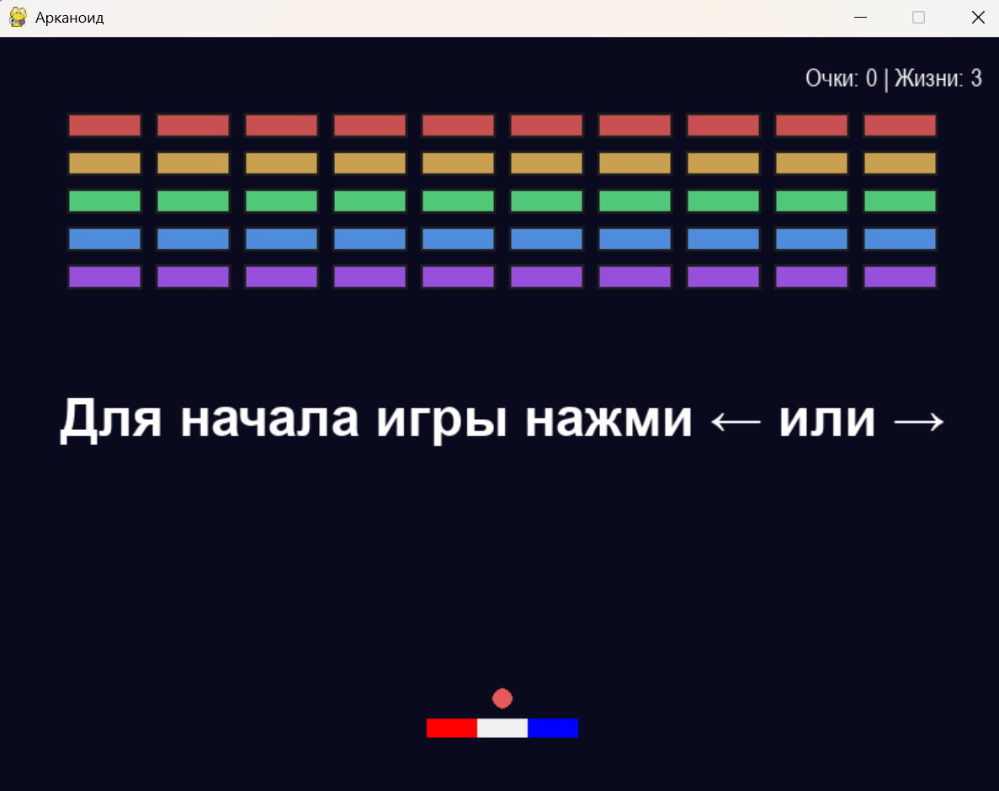

s# 🕹️ Игра Арканоид

Классическая игра Арканоид, написанная на Python с использованием Pygame. Включает в себя систему рекордов, звуковые
эффекты и современный интерфейс.


## 🎮 Особенности

### Геймплей

- **Классический геймплей Арканоид** - отбивайте мяч платформой и разрушайте кубики

### ИИ-система (AI)

- **Авторежим игры** - нажмите "0" для запуска интеллектуального авторежима с именем "robot"
- **Предсказание траектории** - ИИ точно предсказывает траекторию мяча с учетом отскоков от стен
- **Машинное обучение** - система учится на каждом действии и улучшает производительность
- **Визуальная отладка** - отображение предсказанной траектории и оптимальных позиций
- **Система аналитики** - подробная статистика производительности ИИ с сохранением в JSON
- **Интеллектуальное управление** - оптимальное позиционирование платформы для максимальной эффективности

### Система рекордов

- **Подсчет очков** - подсчет очков для каждой игры
- **Отсчет времени** - точное время прохождения каждой игры
- **Топ-10 таблица** - сохранение лучших результатов

### Звуковые эффекты

- **Процедурная генерация звуков** - 16-битные тональные эффекты
- **Фоновая музыка** - для настроения
- **Звуки разрушения** - разные частоты для разных ситуаций

### Интерфейс

- **Полная локализация** - русский язык во всем интерфейсе
- **Контекстные подсказки** - цветное выделение ключевых клавиш (Enter, H, M, ESC)
- **Гибкая навигация** - ESC и крестик для выхода, Backspace для возврата
- **Просмотр рекордов** - по клавише H в любом месте игры
- **Подробная статистика** - очки, время, количество отбитий
- **Отображение скорости** - текущая скорость мяча в правом верхнем углу
- **Управление скоростью** - кнопки ↑/↓ для изменения скорости в реальном времени
- **Экран результатов** - детальная информация по завершении

## 🚀 Установка и запуск

### Вариант 1: Готовый исполняемый файл (рекомендуется)

**Скачайте готовый файл:** `FINAL_RELEASE/Arkanoid_v1.8.0.exe`
- **Размер:** ~30 МБ
- **Требования:** Windows 7/10/11 (64-bit)
- **Установка:** Не требуется, просто запустите файл
- **Переносимость:** Работает с любого места

### Вариант 2: Инсталлятор

**EXE инсталлятор:** `FINAL_RELEASE/Arkanoid_v1.8.0_Setup.exe`
- Автоматическая установка в `%LOCALAPPDATA%\Games\Arkanoid`
- Создание ярлыков на рабочем столе и в меню "Пуск"
- Профессиональный установщик с поддержкой русского языка

**MSI инсталлятор:** `FINAL_RELEASE/Arkanoid_v1.8.0_Setup.msi`
- Профессиональный пакет Windows Installer
- Поддержка групповых политик
- Корпоративное развертывание

### Вариант 3: Запуск из исходного кода

#### Требования

- Python 3.8 или выше
- Poetry (рекомендуется) или pip

#### С Poetry (рекомендуется)

```bash
# Клонирование репозитория
git clone <repository-url>
cd PythonProject2

# Установка зависимостей
poetry install

# Запуск игры
poetry run python PyGameBall.py

# Или активация окружения
poetry shell
python PyGameBall.py
```

#### С pip

```bash
# Установка зависимостей
pip install pygame numpy

# Запуск игры
python PyGameBall.py
```

### Создание собственного инсталлятора

Для создания инсталляторов вам потребуются дополнительные инструменты:

- **Inno Setup** (для EXE инсталляторов): https://jrsoftware.org/isinfo.php
- **WiX Toolset v6.0+** (для MSI инсталляторов): https://github.com/wixtoolset/wix/releases/

**Создание exe:**
```bash
python scripts/build_exe.py
```

**Создание MSI:**
```bash
python scripts/build_msi.py
```

**Смотрите полное руководство:** `docs/INSTALLER_GUIDE.md`

## 🎯 Управление

### В игре

- **← / →** - движение платформы
- **↑ / ↓** - увеличение/уменьшение скорости мяча
- **M** - отключение\включение фоновой музыки
- **ESC** - выход из игры
- **Крестик окна** - выход из игры

### На экране ввода имени

- **H** - просмотр рекордов с возвратом к вводу
- **Backspace** - удаление символа
- **Enter** - завершение ввода
- **M** - отключение\включение фоновой музыки
- **ESC** - выход из игры
- **Крестик окна** - выход из игры

### На экране результатов

- **H** - просмотр рекордов
- **Backspace** - возврат к экрану результатов
- **Enter** - новая игра
- **M** - отключение\включение фоновой музыки
- **ESC** - выход из игры
- **Крестик окна** - выход из игры

## 📊 Структура проекта

```
PythonProject2/
├── PyGameBall.py              # Основной файл игры
├── pyproject.toml             # Конфигурация Poetry и зависимости
├── LICENSE.txt                # Лицензионное соглашение
├── README.md                  # Основная документация
├── changelog.md               # История изменений проекта
├── ai/                        # AI-система
│   ├── __init__.py            # Инициализация модуля AI
│   ├── ai_player.py           # Основной класс AIPlayer
│   ├── game_state.py          # Состояние игры для AI
│   ├── trajectory_predictor.py # Предсказание траектории мяча
│   ├── position_optimizer.py  # Оптимизация позиции платформы
│   ├── learning_system.py     # Система машинного обучения
│   ├── performance_logger.py  # Логирование производительности
│   ├── models/                # Сохраненные модели AI
│   └── logs/                  # Логи сессий AI
├── docs/                      # Документация
│   ├── INSTALLER_GUIDE.md     # Руководство по созданию инсталляторов
│   ├── README_RELEASE.md      # Инструкции по релизу
│   └── README_RELEASE.txt     # Краткое описание релиза
├── scripts/                   # Скрипты сборки и автоматизации
│   ├── build_exe.py           # Сборка исполняемого файла
│   ├── build_msi.py           # Сборка MSI инсталлятора
│   ├── create_msi.py          # Скрипт WiX для MSI инсталлятора
│   ├── create_icon.py         # Создание иконки приложения
│   ├── build_spec.py          # Спецификация сборки PyInstaller
│   ├── create_installer.iss   # Скрипт Inno Setup для EXE инсталлятора
│   └── compile_installer.bat  # Быстрая компиляция EXE инсталлятора
├── build/                     # Временные файлы сборки
├── FINAL_RELEASE/             # Готовые релизы exe и msi
├── resources/                 # Ресурсы приложения
│   ├── icon.ico               # Иконка приложения (256x256)
│   ├── icon.png               # Иконка в PNG формате
│   └── highscores.json        # Файл сохранения результатов
├── sounds/                    # Папка со звуковыми файлами
│   └── Night_Prowler.ogg      # Фоновая музыка
├── images/                    # Папка с изображениями
│   └── img.png                # Скриншот игры
├── tests/                     # Тестовые файлы
└── game_resources/            # Дополнительные игровые ресурсы
```

## 🎵 Звуковая система

### Процедурная генерация звуков

- **Частоты:** 440Гц, 523Гц, 659Гц (ноты A4, C5, E5)
- **Длительность:** 0.2 секунды с экспоненциальным затуханием
- **Формат:** 16-битный стерео, 44.1 кГц
- **Гармоники:** дополнительные частоты для богатого звучания

## 🏆 Система рекордов

### Сортировка результатов

1. **По очкам** (по убыванию)
2. **При равных очках** - по времени игры (по возрастанию)
3. **При равных очках и времени** - по имени (алфавитный порядок)

### Сохранение данных

```json
{
  "player_name": "Игрок",
  "score": 42,
  "time_seconds": 85,
  "time_formatted": "1:25",
  "date": "2025-11-28 13:17"
}
```

## 🔧 Технические детали

### Зависимости

- **pygame** (^2.5.0) - игровая графика и звук
- **numpy** (^1.24.0) - генерация звуковых волн

### Ключевые компоненты

- **Ball class** - управление мячом и физикой
- **Paddle class** - управление платформой
- **HighScoreManager** - работа с рекордами
- **generate_tone_sound()** - процедурная генерация звуков

### Система инсталляторов

**Поддерживаемые форматы:**
- **EXE инсталляторы** (Inno Setup) - простая установка для пользователей
- **MSI пакеты** (WiX Toolset) - корпоративное развертывание
- **Автономные EXE файлы** (PyInstaller) - без установки

**Особенности установки:**
- Автоматическая установка в `%LOCALAPPDATA%\Games\Arkanoid`
- Создание ярлыков на рабочем столе и в меню "Пуск"
- Система рекордов в каталоге игры
- Корректная деинсталляция через "Programs and Features"
- Профессиональная иконка приложения (256x256 пикселей)

**Инструменты разработки:**
- **build_exe.py** - сборка исполняемого файла
- **build_msi.py** - сборка MSI инсталлятора
- **create_installer.iss** - скрипт Inno Setup
- **create_msi.py** - скрипт WiX Toolset
- **create_icon.py** - генерация иконок с PIL/Pillow

### Оптимизации

- Отрисовка только изменяющихся элементов
- Эффективное управление шлейфом мяча
- Оптимизированная генерация звуков
- Кэширование рекордов в памяти
- Единые исполняемые файлы (--onefile) для лучшей переносимости

## 📝 История изменений

Полную историю изменений смотрите в [changelog.md](changelog.md).

### Текущая версия: 1.8.0

- **Революционная AI-система** - полноценная интеллектуальная система управления игрой
- **Авторежим** - нажмите "0" для запуска игры под управлением ИИ с именем "robot"
- **Предсказание траектории** - ИИ точно предсказывает траекторию мяча с учетом отскоков
- **Машинное обучение** - система учится и улучшается с каждой игрой
- **Визуальная отладка** - отображение предсказанной траектории и оптимальных позиций
- **Система аналитики** - подробная статистика производительности ИИ
- **Модульная архитектура** - AI компоненты в папке ai/ с четким разделением


## 🖼️ Скриншот игры



*Классический геймплей с современным интерфейсом на русском языке*

---

## 🔧 Создание инсталляторов

Для создания собственных инсталляторов ознакомьтесь с подробным руководством: **[docs/INSTALLER_GUIDE.md](docs/INSTALLER_GUIDE.md)**

В руководстве описаны:
- Установка необходимых инструментов (Inno Setup, WiX Toolset)
- Автоматическое создание всех типов инсталляторов
- Настройка и кастомизация процесса установки
- Тестирование и устранение неполадок

---

**Приятной игры! 🎮**