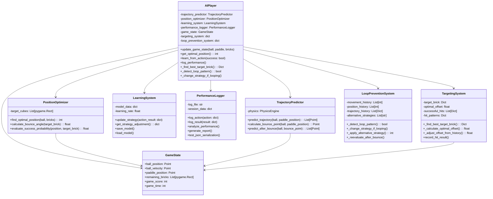
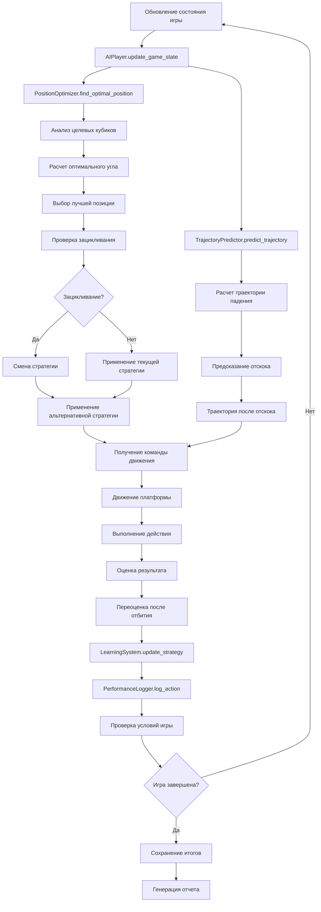
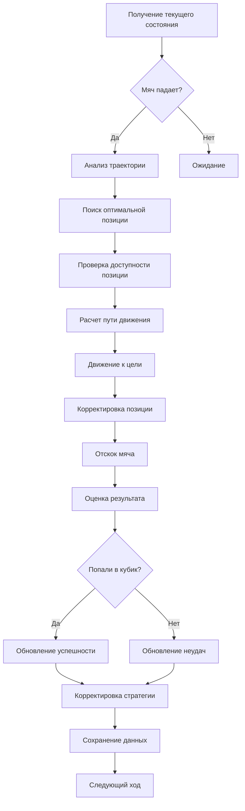
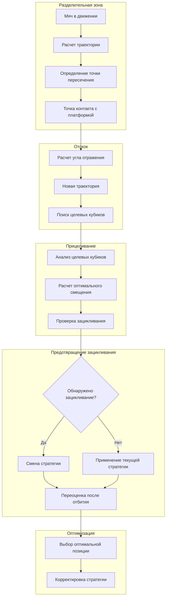

# Диаграмма архитектуры AI-системы

## Поток данных в системе

## Алгоритм принятия решений

## Физическая модель траектории и система предотвращения зацикливания

Эти диаграммы показывают:

1. **Структуру классов** - как компоненты системы взаимодействуют друг с другом
1. **Поток данных** - как информация движется через систему
1. **Алгоритм принятия решений** - логику работы AIPlayer
1. **Физическую модель** - как рассчитывается траектория и отскок

Ключевые принципы:

- **Модульность** - каждый компонент отвечает за свою область
- **Обучение** - система улучшается на основе опыта
- **Физическая точность** - используются реальные законы физики
- **Оптимизация** - поиск наилучших решений на основе вероятностей
