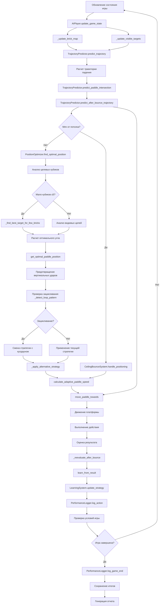
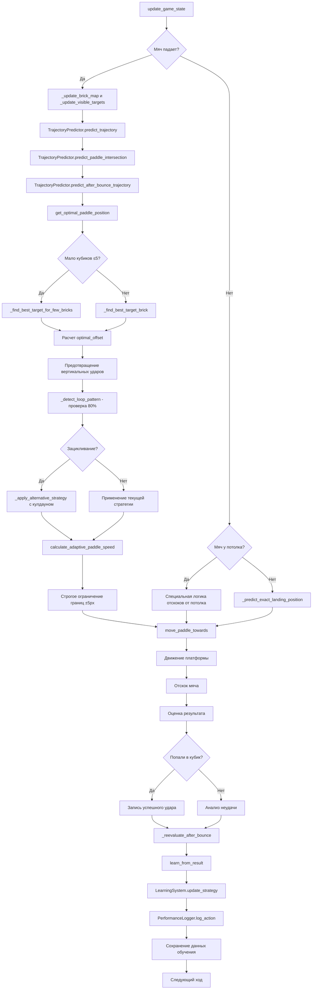
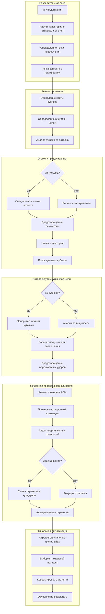

# Диаграмма архитектуры AI-системы

```mermaid
classDiagram
    class AIPlayer {
        -trajectory_predictor: TrajectoryPredictor
        -position_optimizer: PositionOptimizer
        -learning_system: LearningSystem
        -performance_logger: PerformanceLogger
        -current_game_state: GameState
        -targeting_system: dict
        -loop_prevention_system: dict
        -smoothness_system: dict
        -is_active: bool
        +activate()
        +deactivate()
        +update_game_state(ball, paddle, bricks, score, start_time)
        +get_optimal_paddle_position(): int
        +move_paddle_towards(current_x, paddle_speed): int
        +calculate_adaptive_paddle_speed(current_x, optimal_x, ball_speed): int
        +learn_from_result(action_result: Dict)
        +_find_best_target_brick(): Dict
        +_predict_exact_landing_position(): float
        +_detect_loop_pattern(): bool
        +_apply_alternative_strategy(optimal_position): int
        +_reevaluate_after_bounce()
        +_update_loop_tracking()
        +_update_brick_map()
        +_update_visible_targets()
    }

    class TrajectoryPredictor {
        -screen_width: int
        -screen_height: int
        +predict_trajectory(ball, max_steps): List[Point]
        +predict_paddle_intersection(ball, paddle_y): Optional[Point]
        +predict_after_bounce_trajectory(ball, bounce_point, paddle_offset): List[Point]
        +find_optimal_bounce_position(ball, target_brick, paddle_y): Optional[float]
        +_calculate_bounce_velocity_x(ball, paddle_offset): float
        +_evaluate_trajectory_effectiveness(trajectory, bricks): float
    }

    class PositionOptimizer {
        -screen_width: int
        -screen_height: int
        +find_optimal_position(game_state, trajectory_predictor): int
        +calculate_paddle_movement(current_x, target_x, paddle_speed): int
        +evaluate_position_quality(game_state, paddle_x): float
        +find_target_bricks(game_state, trajectory_predictor): List
        +optimize_for_multiple_shots(game_state, trajectory_predictor): int
        +_follow_ball_position(game_state): int
        +_bounce_x_to_paddle_x(bounce_x, paddle_width): int
        +_get_brick_weight(brick): float
    }

    class LearningSystem {
        -model_data: dict
        -model_path: str
        -strategy_weights: dict
        -position_preferences: dict
        -trajectory_patterns: dict
        +update_strategy(action_result: Dict)
        +save_model()
        +load_model()
        +_reinforce_successful_strategy(action_result: Dict)
        +_penalize_failed_strategy(action_result: Dict)
        +_determine_strategy_type(action_result: Dict): str
        +_update_position_preferences(action_result: Dict)
        +_analyze_trajectory_pattern(trajectory_data: Dict, success: bool)
    }

    class PerformanceLogger {
        -session_id: str
        -session_data: dict
        -enable_session_logging: bool
        -log_file: str
        +log_action(action_data: Dict)
        +log_game_start(game_state: GameState)
        +log_game_end(game_state: GameState, success: bool, final_score: int)
        +log_paddle_movement(current_x, target_x, movement)
        +log_trajectory_prediction(predicted_trajectory, actual_result)
        +log_brick_interaction(brick, interaction_type)
        +save_session_log()
        +_generate_session_id(): str
    }

    class TargetingSystem {
        -target_brick: Dict
        -optimal_offset: float
        -successful_hits: List[Dict]
        -brick_map: Dict
        -brick_coordinates: List[Dict]
        -visible_targets: List[Dict]
        -hit_patterns: Dict
        +_update_brick_map()
        +_update_visible_targets()
        +_find_best_target_brick(): Dict
        +_find_best_target_for_few_bricks(): Dict
        +_calculate_optimal_offset(): float
        +_adjust_offset_from_history(): float
        +record_hit_result()
    }

    class LoopPreventionSystem {
        -movement_history: List[int]
        -position_history: List[int]
        -trajectory_history: List[Dict]
        -alternative_strategies: List[str]
        -loop_detection_threshold: int
        -strategy_change_cooldown: int
        -current_strategy_index: int
        +_detect_loop_pattern(): bool
        +_apply_alternative_strategy(optimal_position: int): int
        +_reevaluate_after_bounce()
        +_update_loop_tracking(movement, current_x, optimal_x)
    }
    
    class SmoothnessSystem {
        -recent_movements: List[int]
        -recent_positions: List[int]
        -movement_changes: List[int]
        -jitter_threshold: int
        -jitter_window: int
        -min_movement_distance: int
        -smoothness_penalty: float
        -consecutive_stops: int
    }

    class CeilingBounceSystem {
        +_handle_ceiling_bounce_positioning(): int
        +_track_ball_position(): float
    }

    class GameState {
        +ball_position: Point
        +ball_velocity: Point
        +paddle_position: Point
        +remaining_bricks: List[pygame.Rect]
        +game_score: int
        +game_time: int
    }

    AIPlayer --> TrajectoryPredictor
    AIPlayer --> PositionOptimizer
    AIPlayer --> LearningSystem
    AIPlayer --> PerformanceLogger
    AIPlayer --> GameState
    AIPlayer --> TargetingSystem
    AIPlayer --> LoopPreventionSystem
    AIPlayer --> SmoothnessSystem
    AIPlayer --> CeilingBounceSystem
    PositionOptimizer --> GameState
    PositionOptimizer --> TrajectoryPredictor
    TrajectoryPredictor --> GameState
    TargetingSystem --> GameState
    LoopPreventionSystem --> GameState
    SmoothnessSystem --> GameState
    CeilingBounceSystem --> GameState
    PerformanceLogger --> GameState
```

## Поток данных в системе

## Алгоритм принятия решений

## Физическая модель траектории и система предотвращения зацикливания

Эти диаграммы показывают:

1. **Структуру классов** - как компоненты системы взаимодействуют друг с другом, включая все актуальные методы и системы
1. **Поток данных** - как информация движется через систему с учетом всех компонентов версии 2.2.0002
1. **Алгоритм принятия решений** - обновленную логику работы AIPlayer с реальными методами из кода
1. **Физическую модель** - расширенную модель траектории с анализом отскоков от потолка

## Обновления версии 2.2.0002

Диаграмма обновлена для соответствия реальной реализации кода:

### Основные изменения:
- ✅ Исправлены названия методов: `get_optimal_paddle_position()`, `learn_from_result()`, `move_paddle_towards()`
- ✅ Добавлены методы активации: `activate()`, `deactivate()`
- ✅ Добавлен метод адаптивной скорости: `calculate_adaptive_paddle_speed()`
- ✅ Добавлена система плавности движения: `SmoothnessSystem`
- ✅ Обновлены методы TrajectoryPredictor: `predict_paddle_intersection()`, `predict_after_bounce_trajectory()`
- ✅ Обновлены методы PositionOptimizer: `find_optimal_position()`, `calculate_paddle_movement()`
- ✅ Обновлены методы PerformanceLogger: `log_game_start()`, `log_game_end()`, `log_paddle_movement()`
- ✅ Добавлены связи между компонентами: PositionOptimizer использует TrajectoryPredictor

### Ключевые принципы версии 2.2.0002:

- **Модульность** - каждый компонент отвечает за свою область с четким разделением ответственности
- **Обучение** - система улучшается на основе опыта с сохранением паттернов попаданий
- **Физическая точность** - используются реальные законы физики с учетом отскоков от потолка
- **Оптимизация** - поиск наилучших решений на основе вероятностей и видимости целей
- **Устойчивость** - предотвращение зацикливания с порогом 80% и позиционной стагнацией
- **Адаптивность** - специальная логика для различных сценариев (мало кубиков, отскоки от потолка)
- **Точность** - строгое ограничение границ экрана и предотвращение вертикальных ударов
- **Плавность** - система предотвращения дрожания платформы (SmoothnessSystem)
- **Адаптивная скорость** - динамическая корректировка скорости платформы в зависимости от ситуации
