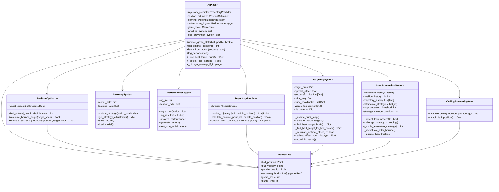
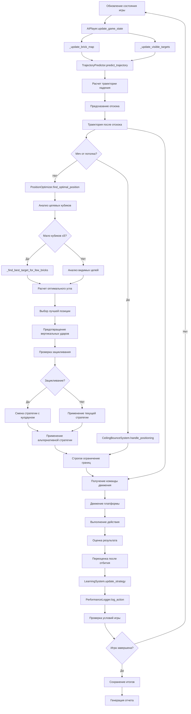
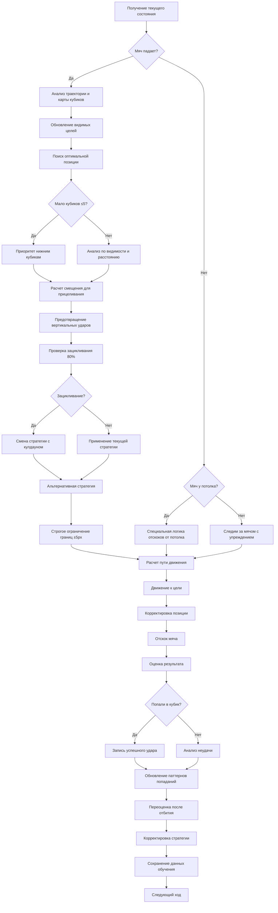
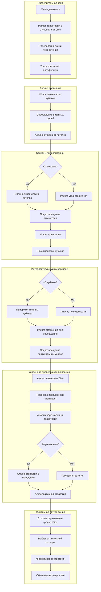

# Диаграмма архитектуры AI-системы

## Поток данных в системе

## Алгоритм принятия решений

## Физическая модель траектории и система предотвращения зацикливания

Эти диаграммы показывают:

1. **Структуру классов** - как компоненты системы взаимодействуют друг с другом
1. **Поток данных** - как информация движется через систему с учетом новых компонентов
1. **Алгоритм принятия решений** - обновленную логику работы AIPlayer с версией 2.1.0
1. **Физическую модель** - расширенную модель траектории с анализом отскоков от потолка

Ключевые принципы версии 2.1.0:

- **Модульность** - каждый компонент отвечает за свою область с четким разделением ответственности
- **Обучение** - система улучшается на основе опыта с сохранением паттернов попаданий
- **Физическая точность** - используются реальные законы физики с учетом отскоков от потолка
- **Оптимизация** - поиск наилучших решений на основе вероятностей и видимости целей
- **Устойчивость** - предотвращение зацикливания с порогом 80% и позиционной стагнацией
- **Адаптивность** - специальная логика для различных сценариев (мало кубиков, отскоки от потолка)
- **Точность** - строгое ограничение границ экрана и предотвращение вертикальных ударов
